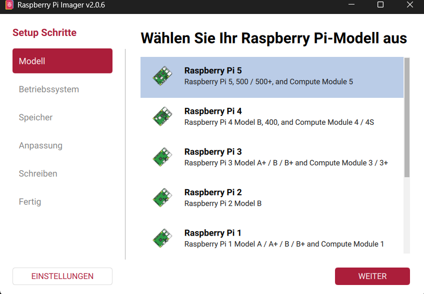
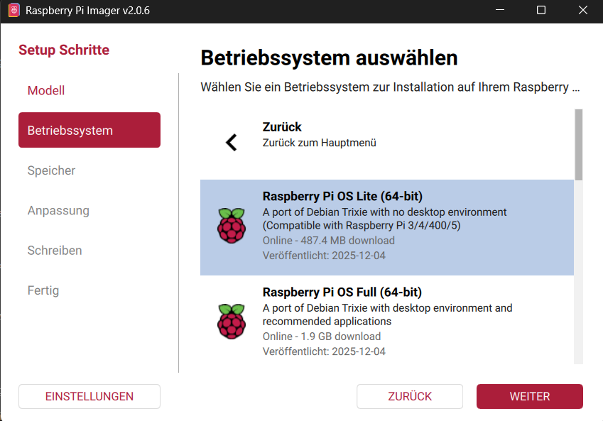
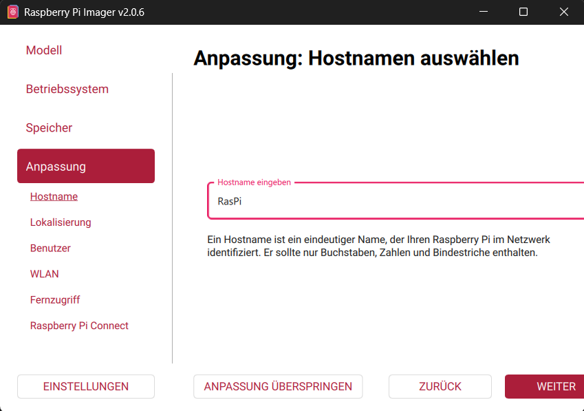
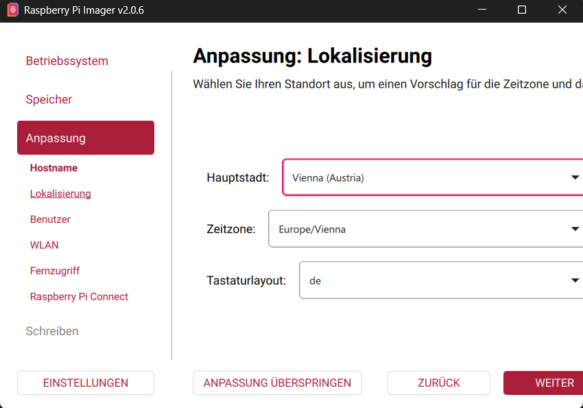
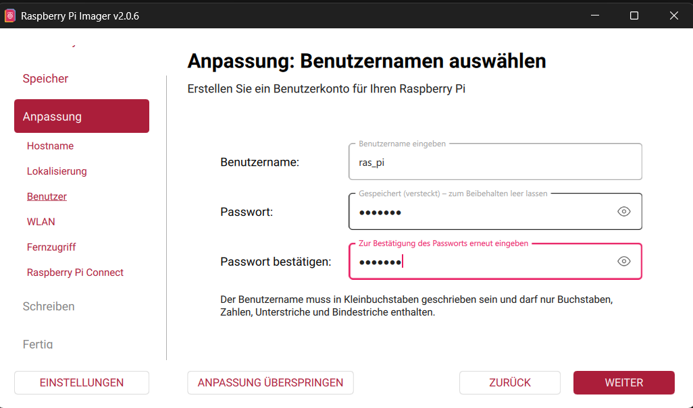
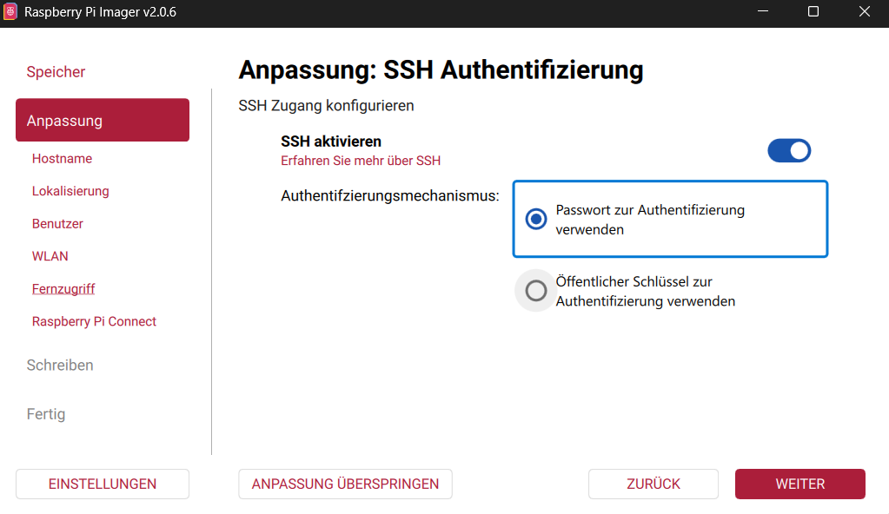
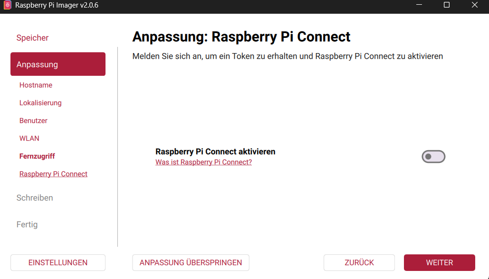
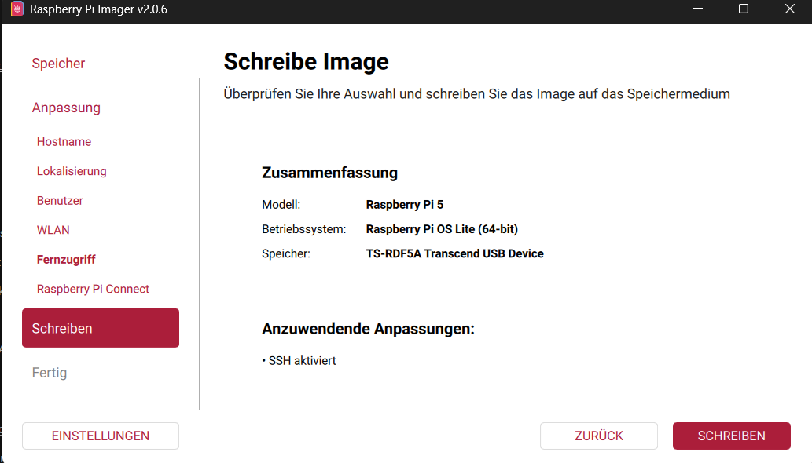
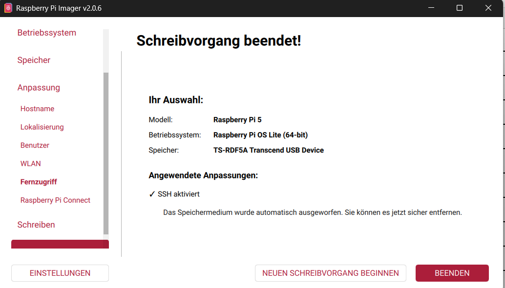
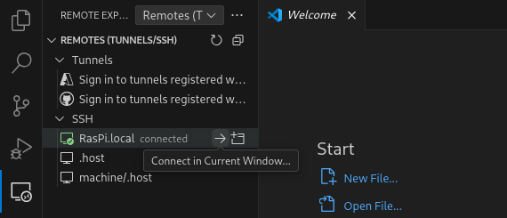

# Installation von Raspberry PI

## Guideline




Bevor dieses Feld erscheint auf "other OS" klicken.







WLAN kann übersprungen werden




Muss jetzt noch nicht aktiviert werden kann später noch aktiviert werden.





Credentials
--- ---------------------- ---     
 | Hostname: RasPi          |     
 | Username: ras_pi         |     
 | Password: RasPi67        |     
 | ssh-pass: Keygen         |    
--- ----------------------- ---     


## Setup über nmap 

### Scan nach Hosts

````sh
nmap -Pn 192.168.11.0/24
````

````sh
Nmap scan report for 192.168.12.52
Host is up (0.00021s latency).
Not shown: 999 closed tcp ports (reset)
PORT   STATE SERVICE
22/tcp open  ssh
MAC Address: 2C:CF:67:8C:B3:54 (Raspberry Pi (Trading))
````

Scan nach allen Online hosts in diesem Netzbereich.

### ICMP Test

````sh
ping 192.168.11.52
````

Auf RaspberryPi und Win erfolgreich

````sh
C:\Users\Felix.Mackinger>ping RasPi.local

Ping wird ausgeführt für RasPi.local [fe80::2ecf:67ff:fe8c:b354%9] mit 32 Bytes Daten:
Antwort von fe80::2ecf:67ff:fe8c:b354%9: Zeit<1ms
Antwort von fe80::2ecf:67ff:fe8c:b354%9: Zeit<1ms
Antwort von fe80::2ecf:67ff:fe8c:b354%9: Zeit<1ms
Antwort von fe80::2ecf:67ff:fe8c:b354%9: Zeit<1ms

Ping-Statistik für fe80::2ecf:67ff:fe8c:b354%9:
    Pakete: Gesendet = 4, Empfangen = 4, Verloren = 0
    (0% Verlust),
Ca. Zeitangaben in Millisek.:
    Minimum = 0ms, Maximum = 0ms, Mittelwert = 0ms
````

Installation von mDNS/Avahi

````sh
sudo apt update   
sudo apt install avahi-daemon libnss-mdns avahi-utils 
sudo systemctl enable --now avahi-daemon 

%% Überprüfung ob installiert
avahi-browse -a
````

Hostname resolving funktioniert anschließend wieder.

````sh
ping RasPi.local                                      
PING RasPi.local (192.168.12.52) 56(84) bytes of data.
64 bytes from 192.168.12.52: icmp_seq=1 ttl=64 time=0.443 ms
64 bytes from 192.168.12.52: icmp_seq=2 ttl=64 time=0.480 ms
64 bytes from 192.168.12.52: icmp_seq=3 ttl=64 time=1.45 ms
^C
--- RasPi.local ping statistics ---
3 packets transmitted, 3 received, 0% packet loss, time 2257ms
rtt min/avg/max/mdev = 0.443/0.791/1.452/0.467 ms
````


### SSH connection

````sh
└$ ssh ras_pi@RasPi.local
The authenticity of host 'raspi.local (192.168.12.52)' can't be established.
ED25519 key fingerprint is SHA256:YY+E4TwciPxTMV5h84eZilacVf2t+YobmjXDq5TetR8.
This key is not known by any other names.
Are you sure you want to continue connecting (yes/no/[fingerprint])? y
Please type 'yes', 'no' or the fingerprint: yes
Warning: Permanently added 'raspi.local' (ED25519) to the list of known hosts.
ras_pi@raspi.local's password: 
Linux RasPi 6.12.47+rpt-rpi-2712 #1 SMP PREEMPT Debian 1:6.12.47-1+rpt1 (2025-09-16) aarch64

The programs included with the Debian GNU/Linux system are free software;
the exact distribution terms for each program are described in the
individual files in /usr/share/doc/*/copyright.

Debian GNU/Linux comes with ABSOLUTELY NO WARRANTY, to the extent
permitted by applicable law.


└$ ssh-keygen -t ed25519
Generating public/private ed25519 key pair.
Enter file in which to save the key (/home/ras_pi/.ssh/Id_ed25519): 
Enter passphrase for "/home/ras_pi/.ssh/Id_ed25519" (empty for no passphrase): 
Enter same passphrase again: 
Your identification has been saved in /home/ras_pi/.ssh/Id_ed25519
Your public key has been saved in /home/ras_pi/.ssh/Id_ed25519.pub
The key fingerprint is:
SHA256:IWe+LN70QZwcDDLYxsnwGrMINWmNpMBpDbbeXptpU3o ras_pi@RasPi
The key's randomart image is:
+--[ED25519 256]--+
|o+B+.*o..        |
|o*=oo.*o o       |
|+o  o.o + o      |
|.... = = + o     |
| ...o. .S =      |
|  . . *. o       |
|   . B.E+ .      |
|    ..o+ . .     |
|      . . .      |
+----[SHA256]-----+


└─$ ssh-copy-id ras_pi@RasPi.local

/usr/bin/ssh-copy-id: INFO: Source of key(s) to be installed: "/home/kali/.ssh/Id_ed25519.pub"
/usr/bin/ssh-copy-id: INFO: attempting to log in with the new key(s), to filter out any that are already installed
/usr/bin/ssh-copy-id: INFO: 1 key(s) remain to be installed -- if you are prompted now it is to install the new keys
ras_pi@raspi.local's password: 

Number of key(s) added: 1

Now try logging into the machine, with: "ssh 'ras_pi@RasPi.local'"
and check to make sure that only the key(s) you wanted were added.
````


# Remote Dev

## Setup VS Code

Installieren der Extension Remote SSH und Remote Dev.

Am VS Code Interface befindet sich links unten ein Remote Dev symbol. 
Danach popt ein wahlmenü auf wo man eine Verbindung mittels verschiedener Methoden starten kann.
Hier Remote SSH auswählen. 

Danach eine neue Host Verbindung einrichten und dann `ras_pi@RasPi.local` eingeben oder ggf. den angepassten Usernamen und Hostnamen abpassen.

Jetzt kann man sich einfach über VS Code in den Raspberry verbinden.



## Nodejs

````sh
sudo apt install nodejs npm
````


